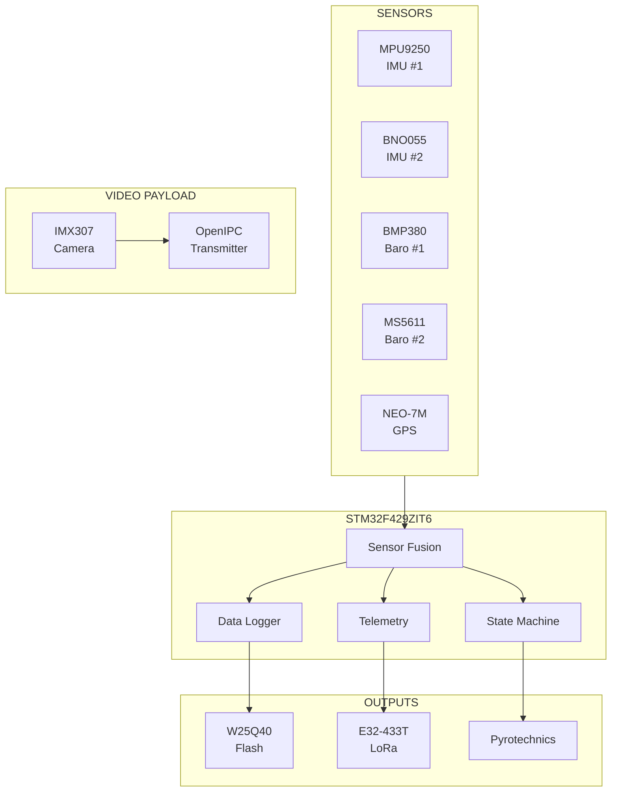
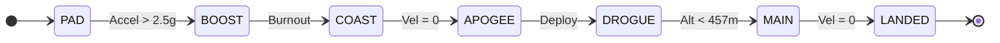

# IREC 2026 Flight Computer

**STM32F429ZIT6 Avionics System** | ARM Cortex-M4F @ 180MHz | Dual-Redundant Sensors

---

## System Specifications

| Parameter | Value |
|-----------|-------|
| **MCU** | STM32F429ZIT6 (ARM Cortex-M4F) |
| **Clock** | 180 MHz |
| **Flash** | 2 MB internal + 512 KB external |
| **RAM** | 256 KB SRAM |
| **Sensors** | Dual IMU, Dual Barometer, GPS |
| **Telemetry** | 433 MHz LoRa, 10 Hz update |
| **Video Payload** | OpenIPC Digital, 720p30 Live Stream |
| **Target Altitude** | 10,000 ft AGL |

---

## Documentation

| Section | Description |
|---------|-------------|
| [System Overview](system-overview) | Architecture, block diagrams, hardware specs |
| [Flight State Machine](flight-state-machine) | State transitions, detection logic |
| [Sensor Fusion](sensor-fusion) | Kalman filter, data processing |
| [Hardware Drivers](drivers) | Sensor and peripheral APIs |
| [Telemetry Protocol](telemetry) | Packet format, ground station communication |
| [Data Logging](data-logging) | Flash memory layout, record formats |
| [Power System](power-system) | Battery, regulation, pyro circuits |
| [Video Payload](video-payload) | OpenIPC digital livestream system |

---

## Architecture



---

## Flight Profile



---

## Quick Start

```bash
# Clone repository
git clone https://github.com/Bumply/IREC-2026.git

# Open in STM32CubeIDE
# Build and flash to target
```

> **Note:** Full build instructions in [System Overview](system-overview)
