# Power System

Complete battery and power distribution system for the IREC 2026 flight computer.

---

## System Overview

### Power Distribution Architecture

```mermaid
flowchart TB
    subgraph BATT["4S LiPo Battery"]
        CELL["4S 14.8V<br/>1300mAh 75C"]
        XT30["XT30<br/>Connector"]
    end

    subgraph PROT["Input Protection"]
        DIODE["Schottky<br/>Reverse Prot"]
        FUSE["10Ω Resistor"]
        CAP["100µF<br/>Bulk Cap"]
    end

    subgraph DIST["Power Distribution"]
        VBAT["VBAT_PROT<br/>14.8V"]
    end

    subgraph REG5V["5V Rail"]
        BUCK["MP1584EN<br/>Buck Converter<br/>5V @ 3A"]
    end

    subgraph REG33V["3.3V Rail"]
        LDO["AMS1117-3.3<br/>LDO<br/>3.3V @ 1A"]
    end

    subgraph LOAD5V["5V Devices"]
        GPS["NEO-7M<br/>GPS<br/>40mA"]
        LORA["E32-433T<br/>LoRa<br/>18-120mA"]
    end

    subgraph LOAD33V["3.3V Devices"]
        MCU["STM32F429<br/>100mA"]
        IMU1["MPU9250<br/>4mA"]
        IMU2["BNO055<br/>12mA"]
        BARO1["BMP380<br/>1mA"]
        BARO2["MS5611<br/>2mA"]
        FLASH["W25Q40<br/>15mA"]
    end

    subgraph PYRO["Pyro System"]
        PYRO_PWR["Direct from<br/>VBAT_PROT"]
    end

    subgraph VIDEO["Video Payload"]
        VBUCK["5V Buck<br/>Mini360<br/>3A"]
        VID_LOAD["OpenIPC + Camera<br/>+ VTX<br/>1.3A"]
    end

    CELL --> XT30
    XT30 --> DIODE
    DIODE --> FUSE
    FUSE --> CAP
    CAP --> VBAT

    VBAT --> BUCK
    VBAT --> PYRO_PWR
    VBAT --> VBUCK

    BUCK --> LDO
    BUCK --> GPS
    BUCK --> LORA

    LDO --> MCU
    LDO --> IMU1
    LDO --> IMU2
    LDO --> BARO1
    LDO --> BARO2
    LDO --> FLASH

    VBUCK --> VID_LOAD
```



### Voltage Rails


---

## Pyrotechnic Power Circuit

### Safety Chain Architecture


### Pyro Channel Circuit

```mermaid
flowchart TB
    subgraph POWER["Power Source"]
        VBAT["VBAT_PROT<br/>14.8V Direct"]
    end

    subgraph CONTROL["Control Circuit"]
        GPIO["PE0/PE2<br/>GPIO Output"]
        RGATE["100Ω<br/>Gate Resistor"]
        RPULL["10kΩ<br/>Pull-down"]
    end

    subgraph SWITCH["Power Switch"]
        FET["IRLZ44N<br/>N-MOSFET<br/>55V 47A"]
    end

    subgraph LOAD["Pyrotechnic"]
        EMATCH["E-Match<br/>1-2Ω"]
    end

    subgraph SENSE["Continuity"]
        ADC["PC2/PC3<br/>ADC Input"]
        RSENSE["10kΩ<br/>Sense Resistor"]
    end

    VBAT --> EMATCH
    EMATCH --> FET
    FET --> GND["GND"]

    GPIO --> RGATE
    RGATE --> FET
    RPULL --> GND

    EMATCH --> RSENSE
    RSENSE --> ADC
```



### Dual Channel Layout


---

## Power Budget

### Normal Operation

| Component | Voltage | Current | Power |
|-----------|---------|---------|-------|
| STM32F429ZIT6 | 3.3V | 100mA | 330mW |
| MPU9250 | 3.3V | 4mA | 13mW |
| BNO055 | 3.3V | 12mA | 40mW |
| BMP380 | 3.3V | 1mA | 3mW |
| MS5611 | 3.3V | 2mA | 7mW |
| W25Q40 (write) | 3.3V | 15mA | 50mW |
| NEO-7M GPS | 5V | 40mA | 200mW |
| E32 LoRa (RX) | 5V | 18mA | 90mW |
| **Flight Computer Subtotal** | | **192mA** | **733mW** |
| | | | |
| **VIDEO PAYLOAD** | | | |
| OpenIPC SSC338Q | 5V | 500mA | 2500mW |
| IMX307 Camera | 5V | 200mA | 1000mW |
| 5.8GHz VTX (25mW mode) | 5V | 300mA | 1500mW |
| **Video Subtotal** | | **1000mA** | **5000mW** |
| | | | |
| **TOTAL SYSTEM** | | **~1.2A** | **~5.7W** |

### Peak Operation (Transmitting + Video at Max Power)

| Component | Voltage | Current | Power |
|-----------|---------|---------|-------|
| Flight Computer (all) | - | 192mA | 733mW |
| E32 LoRa (TX) | 5V | +102mA | +510mW |
| Video (600mW TX mode) | 5V | +1300mA | +6500mW |
| **TOTAL PEAK** | | **~1.6A** | **~7.7W** |

### Pyro Firing (100ms pulse)

| Component | Voltage | Current | Power |
|-----------|---------|---------|-------|
| E-match ignition | 14.8V | 2A | 29.6W |
| Duration | | 100ms | |
| **Energy per fire** | | | **2.96 Wh** |

---

## Battery Selection

### Recommended: 4S 1300mAh 75C LiPo

> **Note:** With video payload, we upgraded from 650mAh to 1300mAh for adequate runtime.

| Parameter | Value |
|-----------|-------|
| **Chemistry** | Lithium Polymer (LiPo) |
| **Configuration** | 4S (4 cells in series) |
| **Nominal Voltage** | 14.8V |
| **Full Charge** | 16.8V |
| **Empty (safe)** | 13.2V (3.3V/cell) |
| **Capacity** | 1300mAh |
| **C Rating** | 75C continuous |
| **Max Discharge** | 97.5A (way more than needed) |
| **Weight** | ~140g |
| **Connector** | XT30 (main) + JST-XH (balance) |

### Flight Duration Calculation

```
Battery Capacity:     1300mAh
Average Draw:         ~1200mA (flight computer + video streaming)
Theoretical Runtime:  1300 / 1200 = 1.08 hours = 65 minutes

Actual Flight Time:   ~3 minutes (boost to landing)
Ground Ops:           ~30 minutes (power on to launch)
Total Mission:        ~35 minutes

Safety Margin:        65 / 35 = 1.86x margin ✓

Note: For longer ground ops, keep video in standby until T-5 minutes
      Standby draw: ~400mA → 3.25 hour runtime
```

---

## Voltage Monitoring

### ADC Configuration

```mermaid
flowchart LR
    subgraph DIVIDER["Voltage Divider (6:1)"]
        VBAT["VBAT<br/>14.8-16.8V"]
        R1["50kΩ"]
        R2["10kΩ"]
        ADC["PC0 ADC<br/>2.2-2.8V"]
    end

    VBAT --> R1
    R1 --> ADC
    ADC --> R2
    R2 --> GND["GND"]
```



**Divider Calculation:**
- Ratio: 10k / (50k + 10k) = 0.167
- At 16.8V (full): ADC sees 2.8V ✓
- At 14.8V (nominal): ADC sees 2.47V ✓
- At 13.2V (empty): ADC sees 2.2V ✓

### Voltage Thresholds

| Battery Voltage | ADC Voltage | Status | Action |
|-----------------|-------------|--------|--------|
| > 16.0V | > 2.67V | Overcharged | Warning |
| 14.8V - 16.0V | 2.47V - 2.67V | **Normal** | OK |
| 13.6V - 14.8V | 2.27V - 2.47V | Low | Warning LED |
| 13.2V - 13.6V | 2.20V - 2.27V | Critical | Abort launch |
| < 13.2V | < 2.20V | Dead | Shutdown |

---

## Safety Features

### 1. Reverse Polarity Protection
Schottky diode in series prevents damage if battery connected backwards.

### 2. Pyro Safety Chain

```mermaid
flowchart LR
    HW["Hardware<br/>Arm Switch<br/>(PE4)"]
    SW["Software<br/>Arm Flag"]
    STATE["State<br/>Machine"]
    AND{{"AND"}}
    FIRE["🔥 FIRE<br/>PYRO"]

    HW --> AND
    SW --> AND
    STATE --> AND
    AND --> FIRE
```



All three conditions must be TRUE to fire.

### 3. Continuity Check
Before launch, verify e-matches are connected:
- Expected: ~1.5V (voltage divider with e-match resistance)
- Open circuit: 0V or 3.3V
- Short circuit: 0V

### 4. Auto-Shutoff
Pyro GPIO automatically turns OFF after 100ms to prevent:
- MOSFET overheating
- Battery drain
- Continuous firing

---

## Connector Pinout

### Connectors Overview


---

## Bill of Materials

### Flight Computer Power

| Component | Part Number | Qty | Notes |
|-----------|-------------|-----|-------|
| LiPo Battery | 4S 1300mAh 75C | 1 | Main power (upgraded for video) |
| Buck Converter | MP1584EN module | 1 | 5V output (FC) |
| LDO Regulator | AMS1117-3.3 | 1 | 3.3V output |
| Schottky Diode | SS34 | 1 | Reverse protection |
| MOSFET | IRLZ44N | 2 | Pyro drivers |
| Capacitor | 100µF 25V | 1 | Input bulk |
| Capacitor | 22µF 10V | 2 | Buck output |
| Capacitor | 10µF 10V | 2 | LDO output |
| Resistor | 100Ω | 2 | Gate resistors |
| Resistor | 10kΩ | 6 | Pull-downs, dividers |
| Resistor | 50kΩ | 1 | Voltage divider |
| Inductor | 33µH | 1 | Buck converter |
| Connector | XT30 | 1 pair | Power |
| Connector | JST-XH 5P | 1 | Balance |
| Switch | SPST Toggle | 1 | Main arm |

### Video Payload Power

| Component | Part Number | Qty | Notes |
|-----------|-------------|-----|-------|
| Buck Converter | Mini360 (MP2307) | 1 | 5V @ 3A for video |
| Capacitor | 100µF 10V | 2 | Video power filtering |
| LC Filter | 10µH + 100µF | 1 | RF noise suppression |
| Switch | SPST Toggle | 1 | Video power switch |

---

## Pre-Flight Checklist

### Power System
- [ ] Battery voltage > 15.5V (freshly charged)
- [ ] Main arm switch OFF
- [ ] Pyro arm switch OFF
- [ ] Video power switch OFF
- [ ] Power ON - verify LED
- [ ] Check battery voltage on ground station
- [ ] Verify drogue continuity
- [ ] Verify main continuity

### Video Payload
- [ ] Video power switch ON (T-5 min)
- [ ] Verify video stream on ground receiver
- [ ] Check video latency < 100ms
- [ ] Confirm recording indicator

### Final
- [ ] All systems GO
- [ ] Arm pyro switch (at pad)
- [ ] Clear area
- [ ] Launch!
