# Power System

Complete battery and power distribution system for the IREC 2026 flight computer.

---

## Batteries Used in Recovery System

Detailed specifications of all batteries in the flight electronics system:

### Battery Inventory

> **⚠️ IREC Compliance Note:** Per DTEG Section 6.17.1.1, **LiPo batteries are PROHIBITED** due to fire hazard. We use **Li-Ion 18650 cells in cylindrical metallic casing** and **LiPo for the Featherweight GPS** (commercial product, independently tested).

| Component | Battery Type | Chemistry | Cells | Size | Capacity | Protection | Voltage Range |
|-----------|--------------|-----------|-------|------|----------|------------|---------------|
| **Flight Computer** | 18650 Li-Ion Pack | Lithium Ion | 4S | 18mm×65mm×4 | 2500mAh | **Protected** (BMS + cell-level) | 12.0V - 16.8V |
| **Video Payload** | (Shared with FC) | Lithium Ion | 4S | - | - | **Protected** | - |
| **Featherweight GPS Tracker** | LiPo Cell | Lithium Polymer | 1S | 400mAh | 400mAh | **Unprotected** | 3.0V - 4.2V |

### Flight Computer Battery - Detailed Specifications


| Parameter | Specification |
|-----------|---------------|
| **Cell Type** | 18650 Lithium Ion (cylindrical metallic casing) |
| **Recommended Cells** | Samsung 25R, Sony VTC6, LG HG2, Panasonic NCR18650B |
| **Chemistry** | Lithium Ion (Li-Ion) |
| **Configuration** | 4S1P (4 cells in series) |
| **Nominal Voltage** | 14.8V (3.7V × 4) |
| **Full Charge Voltage** | 16.8V (4.2V × 4) |
| **Discharge Cutoff** | 12.0V (3.0V × 4) |
| **Capacity** | 2500-3000mAh (depending on cell) |
| **Max Discharge** | 20A continuous (Samsung 25R) |
| **Physical Size** | ~75 × 40 × 20 mm (4S holder) |
| **Weight** | ~200g (4 × 50g cells) |
| **Main Connector** | XT30 (rated 30A continuous) |
| **Balance Connector** | JST-XH 5-pin |
| **Protection** | PCB with balance leads + cell-level protection |
| **IREC Compliance** | ✅ DTEG 6.17.2.1 - Cylindrical metallic casing allowed |

### Featherweight GPS Tracker Battery - Detailed Specifications


| Parameter | Specification |
|-----------|---------------|
| **Product** | Featherweight GPS Tracker (Full System) |
| **Battery Type** | 1S LiPo (included with tracker kit) |
| **Chemistry** | Lithium Polymer |
| **Configuration** | 1S (single cell) |
| **Nominal Voltage** | 3.7V |
| **Full Charge Voltage** | 4.2V |
| **Capacity** | 400mAh |
| **Runtime** | 16 hours (per manufacturer spec) |
| **Protection** | Unprotected (per Featherweight design) |
| **Charger** | Featherweight Dual Battery Charger |
| **Purpose** | Backup/redundant GPS tracking |
| **Independence** | Completely separate from flight computer |

> **Note:** The Featherweight GPS is a **commercial off-the-shelf (COTS)** product with its own battery system. It operates independently from the main flight computer for redundant tracking capability.

### Protection Circuit Details

The flight computer battery pack includes integrated protection:

| Protection Type | Threshold | Action |
|-----------------|-----------|--------|
| **Overcharge** | >4.25V per cell | Cuts charging current |
| **Overdischarge** | <2.8V per cell | Disconnects load |
| **Overcurrent** | >25A | Current limiting |
| **Short Circuit** | Instantaneous | Immediate disconnect |
| **Cell Balancing** | Via balance connector | During charging only |

### Why 18650 Li-Ion? (IREC Compliant & Affordable)

| Feature | 18650 Li-Ion | LiPo (prohibited) | LiFePO4 |
|---------|--------------|-------------------|---------|
| **IREC Allowed** | ✅ Yes (metallic casing) | ❌ **BANNED** | ✅ Yes |
| **Cost** | **~$5/cell** | ~$15/pack | ~$30/pack |
| **Availability** | Everywhere | - | Specialty |
| **Energy Density** | High | Highest | Lower |
| **Safety** | Good (metal case) | Poor (pouch) | Excellent |
| **Cycle Life** | 500+ cycles | 300 cycles | 2000+ cycles |

> **Note:** External protection is also provided on the flight computer PCB via Schottky diode (reverse polarity) and 10Ω current-limiting resistor.

---

## Featherweight GPS Tracker (Backup Tracking System)

The Featherweight GPS Tracker provides **redundant, independent GPS tracking** separate from the main flight computer.

### System Components

| Component | Description |
|-----------|-------------|
| **GPS Tracker** | Featherweight GPS Tracker board with u-blox M10 GPS |
| **Ground Station** | Featherweight Ground Station (receives telemetry) |
| **Tracker Battery** | 1S 400mAh LiPo + JST adapter |
| **Antenna** | 915 MHz stub antenna |
| **App** | Featherweight UI (iOS/Android) |

### Specifications

| Parameter | Value |
|-----------|-------|
| **GPS Chip** | u-blox M10 (GPS, GLONASS, Galileo, BeiDou) |
| **Max Altitude** | 262,467 feet (80 km) |
| **Max Velocity** | 500 m/s (Mach 1.45) |
| **Update Rate** | 10 Hz |
| **Radio Frequency** | 915 MHz |
| **TX Power** | 100 mW |
| **Board Size** | 1.67" × 0.8" (42 × 20 mm) |
| **Battery Life** | 16 hours on 400mAh LiPo |
| **Range** | Line-of-sight to space (per manufacturer) |

### Why Use a Separate GPS Tracker?


| Benefit | Explanation |
|---------|-------------|
| **Redundancy** | If flight computer fails, Featherweight still tracks |
| **Independent Power** | Separate battery survives main system failure |
| **Proven Reliability** | Commercial product used by thousands of rocketeers |
| **IREC Recovery** | Critical for finding rockets in desert terrain |
| **Simple Installation** | Mounts on shock cord near parachute |

### Featherweight Battery Management

| Practice | Procedure |
|----------|-----------|
| **Charging** | Use Featherweight Dual Battery Charger |
| **Pre-Flight** | Charge within 24 hours, verify 4.0V+ |
| **Storage** | Store at ~3.8V (50% charge) |
| **Runtime** | 16 hours - more than enough for IREC operations |
| **Replacement** | Replace battery annually or if capacity drops |

---

## Battery Management Practices

### Charging Procedures


| Practice | Procedure |
|----------|-----------|
| **Charger Type** | Balance charger with Li-Ion mode (e.g., ISDT D2, SkyRC B6, Nitecore) |
| **Charge Rate** | 0.5C recommended, 1C maximum (2.5A for 2500mAh pack) |
| **Charge Mode** | **Li-Ion Balance mode** (4.2V/cell cutoff) |
| **Cell Balance** | All cells within 0.02V at end of charge |
| **Max Voltage** | 4.20V per cell (16.8V total) - NEVER exceed |
| **Temperature** | Charge at 10-40°C ambient only |
| **Supervision** | Monitor during charging |
| **Fire Safety** | Charge on fireproof surface, away from flammables |

### Capacity Verification

Before each flight campaign:

```mermaid
flowchart LR
    FULL["Charge to<br/>100%<br/>(16.8V)"]
    DISCHARGE["Discharge at<br/>0.5C to 12.0V"]
    MEASURE["Record<br/>mAh delivered"]
    EVALUATE["Capacity<br/>>80% nominal?"]
    PASS["✓ Flight<br/>Ready"]
    FAIL["✗ Retire<br/>Battery"]

    FULL --> DISCHARGE --> MEASURE --> EVALUATE
    EVALUATE -->|Yes| PASS
    EVALUATE -->|No| FAIL
```



| Test | Acceptance Criteria |
|------|---------------------|
| **Full Capacity** | ≥80% of rated capacity (≥2000mAh for 2500mAh cells) |
| **Cell Balance** | All cells within 0.05V under load |
| **Internal Resistance** | <80mΩ per cell (measured by charger) |
| **Physical Inspection** | No dents, rust, or damage to metallic casing |

### Storage Voltage Protocol

```mermaid
flowchart TB
    subgraph STORAGE["Storage Protocol"]
        CHARGE_ST["Charge/Discharge<br/>to Storage Voltage"]
        VOLTAGE["Target: 3.7V/cell<br/>(14.8V total)"]
        CONTAINER["Store in<br/>cool, dry location"]
        LOCATION["Room temperature<br/>15-25°C"]
    end

    CHARGE_ST --> VOLTAGE --> CONTAINER --> LOCATION
```



| Storage Practice | Specification |
|------------------|---------------|
| **Storage Voltage** | 3.6-3.8V per cell (14.4-15.2V total) - ~40-60% SOC |
| **Storage Mode** | Use charger's "Storage" function |
| **Temperature** | Store at 15-25°C (room temperature) |
| **Humidity** | Low humidity, avoid condensation |
| **Container** | Any safe container |
| **Duration** | Re-check voltage every 2-3 months |
| **Before Flight** | Charge to full within 24 hours of launch |

### Battery Age Monitoring

| Tracking Item | Method | Action Threshold |
|---------------|--------|------------------|
| **Purchase Date** | Label on battery | Retire after 3 years |
| **Cycle Count** | Log in spreadsheet | Retire after 300 cycles |
| **Capacity Fade** | Periodic capacity test | Retire if <80% capacity |
| **Internal Resistance** | Charger measurement | Retire if >100mΩ/cell |
| **Physical Condition** | Visual inspection | Retire if dented/damaged |

### Pre-Flight Battery Checklist

- [ ] Battery fully charged within last 24 hours
- [ ] Voltage verified: 16.4V - 16.8V (>98% charge)
- [ ] All cells balanced within 0.02V
- [ ] Visual inspection: metallic casing intact, no dents
- [ ] Capacity verified within last 30 days (>80%)
- [ ] Cycle count logged and within limits (<300)
- [ ] Battery age within limits (<3 years)
- [ ] Connectors clean and secure
- [ ] Battery secured in rocket with padding
- [ ] **IREC compliance: 18650 cylindrical metallic casing confirmed** ✅

### Emergency Procedures

| Situation | Action |
|-----------|--------|
| **Overheating during charge** | Disconnect immediately, move to fireproof area |
| **Physical damage** | Do not use, discharge safely, dispose at battery recycling |
| **Cell venting** | Evacuate area, do not inhale fumes, allow to cool |
| **Crash recovery** | Inspect cells for dents before handling |

> **Note:** 18650 Li-Ion cells with metallic casing are safer than pouch LiPo cells - the metal case provides structural protection and contains any potential failure.

---

## System Overview

### Power Distribution Architecture


### Voltage Rails


---

## Pyrotechnic Power Circuit

### 4-Inhibit Safety Chain (IREC Compliant)

Per IREC DTEG requirements, pyrotechnic systems must have **multiple independent inhibits**. Our system uses a **4-key arming architecture** where ALL conditions must be TRUE before any pyro channel can fire.


### Inhibit Details

| Inhibit | Type | Location | Arm Method | Safe State |
|---------|------|----------|------------|------------|
| **1. Main Power** | Hardware | External toggle switch | Flip ON at pad | OFF = No power to system |
| **2. Pull Pin Arm** | Hardware | External pull pin (PE4 input) | Remove pin at pad | Pin IN = Pyro circuit disabled |
| **3. Software Arm** | Software | Ground station via LoRa | Send ARM command | Default DISARMED on boot |
| **4. Flight State** | Software | State machine logic | Auto-transitions in flight | IDLE/PAD = Cannot fire |

### Arming Sequence

```mermaid
flowchart LR
    subgraph GROUND["Ground Operations"]
        G1["1. Power ON<br/>(Main Switch)"]
        G2["2. System Boot<br/>(Self-test)"]
        G3["3. Verify Continuity<br/>(Ground Station)"]
    end

    subgraph PAD["At Launch Pad"]
        P1["4. Remove Pull Pin<br/>(Hardware Arm)"]
        P2["5. Send ARM Command<br/>(Software Arm)"]
        P3["6. Verify ARMED<br/>(Green LED)"]
    end

    subgraph FLIGHT["In Flight"]
        F1["7. Detect Launch<br/>(Accel Trigger)"]
        F2["8. Detect Apogee<br/>(State → DESCENT)"]
        F3["9. FIRE Drogue<br/>(All 4 Keys TRUE)"]
        F4["10. Altitude < 500m"]
        F5["11. FIRE Main<br/>(All 4 Keys TRUE)"]
    end

    G1 --> G2 --> G3 --> P1 --> P2 --> P3 --> F1 --> F2 --> F3 --> F4 --> F5
```



### Fire Logic (C Code)

```c
// 4-Inhibit Arming Check
bool can_fire_pyro(void) {
    return (
        main_power_on &&                    // Inhibit 1: Power switch ON
        gpio_read(PULL_PIN_ARM) == HIGH &&  // Inhibit 2: Pull pin removed
        software_arm_flag == true &&        // Inhibit 3: Ground station armed
        (flight_state == DESCENT ||         // Inhibit 4: Correct flight state
         flight_state == MAIN_DEPLOY)
    );
}

// Drogue Fire Decision
void check_drogue_fire(void) {
    if (can_fire_pyro() && 
        flight_state == DESCENT && 
        drogue_continuity_ok &&
        !drogue_fired) {
        fire_drogue();
        drogue_fired = true;
    }
}

// Main Fire Decision  
void check_main_fire(void) {
    if (can_fire_pyro() && 
        altitude_agl < 500 &&  // meters
        main_continuity_ok &&
        drogue_fired &&        // Drogue must fire first
        !main_fired) {
        fire_main();
        main_fired = true;
    }
}
```

### Safety Features

| Feature | Purpose |
|---------|---------|
| **Default DISARMED** | Software arm flag is FALSE on boot |
| **Pull pin physical** | Cannot accidentally arm remotely |
| **State machine required** | Won't fire on ground even if armed |
| **Continuity check** | Warns if e-match disconnected |
| **100ms auto-off** | MOSFET turns off after firing to prevent damage |
| **Dual channels independent** | One failure doesn't affect other |

### Pyro Channel Circuit


### Dual Channel Layout


---

## Power Budget

### Normal Operation

| Component | Voltage | Current | Power |
|-----------|---------|---------|-------|
| STM32F429ZIT6 | 3.3V | 100mA | 330mW |
| MPU9250 | 3.3V | 4mA | 13mW |
| BNO055 | 3.3V | 12mA | 40mW |
| BMP380 | 3.3V | 1mA | 3mW |
| MS5611 | 3.3V | 2mA | 7mW |
| W25Q40 (write) | 3.3V | 15mA | 50mW |
| NEO-7M GPS | 5V | 40mA | 200mW |
| E32 LoRa (RX) | 5V | 18mA | 90mW |
| **Flight Computer Subtotal** | | **192mA** | **733mW** |
| | | | |
| **VIDEO PAYLOAD** | | | |
| OpenIPC SSC338Q | 5V | 500mA | 2500mW |
| IMX307 Camera | 5V | 200mA | 1000mW |
| 5.8GHz VTX (25mW mode) | 5V | 300mA | 1500mW |
| **Video Subtotal** | | **1000mA** | **5000mW** |
| | | | |
| **TOTAL SYSTEM** | | **~1.2A** | **~5.7W** |

### Peak Operation (Transmitting + Video at Max Power)

| Component | Voltage | Current | Power |
|-----------|---------|---------|-------|
| Flight Computer (all) | - | 192mA | 733mW |
| E32 LoRa (TX) | 5V | +102mA | +510mW |
| Video (600mW TX mode) | 5V | +1300mA | +6500mW |
| **TOTAL PEAK** | | **~1.6A** | **~7.7W** |

### Pyro Firing (100ms pulse)

| Component | Voltage | Current | Power |
|-----------|---------|---------|-------|
| E-match ignition | 14.8V | 2A | 29.6W |
| Duration | | 100ms | |
| **Energy per fire** | | | **2.96 Wh** |

---

## Battery Selection

### 4S Li-Ion 18650 Pack (2500mAh)

> **Note:** Li-Ion 18650 cells with cylindrical metallic casing are IREC-compliant per DTEG 6.17.2.1.

| Parameter | Value |
|-----------|-------|
| **Chemistry** | Lithium-Ion (Li-Ion) |
| **Cell Type** | 18650 Cylindrical (Samsung 25R / Sony VTC6) |
| **Configuration** | 4S1P (4 cells in series) |
| **Nominal Voltage** | 14.8V (3.7V/cell) |
| **Full Charge** | 16.8V (4.2V/cell) |
| **Cutoff (safe)** | 12.0V (3.0V/cell) |
| **Capacity** | 2500mAh |
| **Max Continuous** | 20A (Samsung 25R) / 30A (Sony VTC6) |
| **Weight** | ~200g (50g × 4 cells) |
| **Connector** | XT30 (main) + JST-XH (balance) |
| **IREC Compliance** | ✅ DTEG 6.17.2.1 - Cylindrical metallic casing |

### Flight Duration Calculation

```
Battery Capacity:     2500mAh
Average Draw:         ~1200mA (flight computer + video streaming)
Theoretical Runtime:  2500 / 1200 = 2.08 hours = 125 minutes

Actual Flight Time:   ~3 minutes (boost to landing)
Ground Ops:           ~30 minutes (power on to launch)
Total Mission:        ~35 minutes

Safety Margin:        125 / 35 = 3.57x margin ✓ (EXCELLENT)

Note: For longer ground ops, keep video in standby until T-5 minutes
      Standby draw: ~400mA → 6.25 hour runtime
```

---

## Voltage Monitoring

### ADC Configuration

```mermaid
flowchart LR
    subgraph DIVIDER["Voltage Divider (6:1)"]
        VBAT["VBAT<br/>14.8-16.8V"]
        R1["50kΩ"]
        R2["10kΩ"]
        ADC["PC0 ADC<br/>2.2-2.8V"]
    end

    VBAT --> R1
    R1 --> ADC
    ADC --> R2
    R2 --> GND["GND"]
```



**Divider Calculation:**
- Ratio: 10k / (50k + 10k) = 0.167
- At 16.8V (full): ADC sees 2.8V ✓
- At 14.8V (nominal): ADC sees 2.47V ✓
- At 13.2V (empty): ADC sees 2.2V ✓

### Voltage Thresholds

| Battery Voltage | ADC Voltage | Status | Action |
|-----------------|-------------|--------|--------|
| > 16.4V | > 2.73V | Full | OK (just charged) |
| 14.8V - 16.4V | 2.47V - 2.73V | **Normal** | OK |
| 13.0V - 14.8V | 2.17V - 2.47V | Low | Warning LED |
| 12.0V - 13.0V | 2.00V - 2.17V | Critical | Abort launch |
| < 12.0V | < 2.00V | Cutoff | Shutdown |

---

## Safety Features

### 1. Reverse Polarity Protection
Schottky diode in series prevents damage if battery connected backwards.

### 2. Pyro Safety Chain

```mermaid
flowchart LR
    HW["Hardware<br/>Arm Switch<br/>(PE4)"]
    SW["Software<br/>Arm Flag"]
    STATE["State<br/>Machine"]
    AND{{"AND"}}
    FIRE["🔥 FIRE<br/>PYRO"]

    HW --> AND
    SW --> AND
    STATE --> AND
    AND --> FIRE
```



All three conditions must be TRUE to fire.

### 3. Continuity Check
Before launch, verify e-matches are connected:
- Expected: ~1.5V (voltage divider with e-match resistance)
- Open circuit: 0V or 3.3V
- Short circuit: 0V

### 4. Auto-Shutoff
Pyro GPIO automatically turns OFF after 100ms to prevent:
- MOSFET overheating
- Battery drain
- Continuous firing

---

## Connector Pinout

### Connectors Overview


---

## Bill of Materials

### Flight Computer Power

| Component | Part Number | Qty | Notes |
|-----------|-------------|-----|-------|
| Li-Ion Battery | 4S1P 18650 (Samsung 25R) | 1 | Main power - IREC compliant |
| Buck Converter | MP1584EN module | 1 | 5V output (FC) |
| LDO Regulator | AMS1117-3.3 | 1 | 3.3V output |
| Schottky Diode | SS34 | 1 | Reverse protection |
| MOSFET | IRLZ44N | 2 | Pyro drivers |
| Capacitor | 100µF 25V | 1 | Input bulk |
| Capacitor | 22µF 10V | 2 | Buck output |
| Capacitor | 10µF 10V | 2 | LDO output |
| Resistor | 100Ω | 2 | Gate resistors |
| Resistor | 10kΩ | 6 | Pull-downs, dividers |
| Resistor | 50kΩ | 1 | Voltage divider |
| Inductor | 33µH | 1 | Buck converter |
| Connector | XT30 | 1 pair | Power |
| Connector | JST-XH 5P | 1 | Balance |
| Switch | SPST Toggle | 1 | Main arm |
| 18650 Holder | 4-cell series | 1 | Battery enclosure |
| BMS | 4S 20A | 1 | Protection circuit |

### Video Payload Power

| Component | Part Number | Qty | Notes |
|-----------|-------------|-----|-------|
| Buck Converter | Mini360 (MP2307) | 1 | 5V @ 3A for video |
| Capacitor | 100µF 10V | 2 | Video power filtering |
| LC Filter | 10µH + 100µF | 1 | RF noise suppression |
| Switch | SPST Toggle | 1 | Video power switch |

---

## Pre-Flight Checklist

### Power System
- [ ] Battery voltage > 16.0V (freshly charged)
- [ ] Cell balance within 0.02V
- [ ] Main arm switch OFF
- [ ] Pyro arm switch OFF
- [ ] Video power switch OFF
- [ ] Power ON - verify LED
- [ ] Check battery voltage on ground station
- [ ] Verify drogue continuity
- [ ] Verify main continuity

### Video Payload
- [ ] Video power switch ON (T-5 min)
- [ ] Verify video stream on ground receiver
- [ ] Check video latency < 100ms
- [ ] Confirm recording indicator

### Final
- [ ] All systems GO
- [ ] **IREC battery compliance verified (Li-Ion 18650)** ✅
- [ ] Arm pyro switch (at pad)
- [ ] Clear area
- [ ] Launch!
