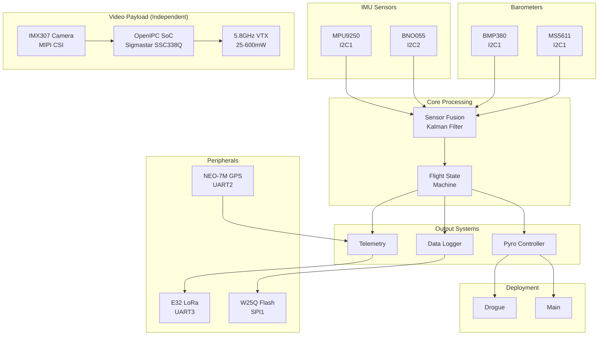
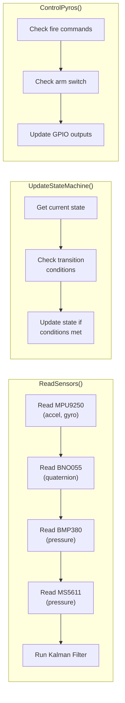

# System Overview

The IREC 2026 flight computer is a dual-redundant avionics system designed for high-power rocketry. This page explains the complete system architecture, why each component was selected, and how everything works together.

---

## Design Philosophy

Before diving into the hardware, it's important to understand the core design principles that shaped this system:

### Why Dual Redundancy?

In rocketry, the parachute deployment system is **safety-critical**. If it fails:
- The rocket becomes a ballistic missile
- People on the ground could be injured or killed
- The rocket is destroyed

For this reason, we use **dual redundancy** on the most critical sensors:

| Component | Why Two? |
|-----------|----------|
| **IMUs** | Detect launch, burnout, and calculate velocity for apogee detection |
| **Barometers** | Measure altitude for main parachute deployment |

If one sensor fails, the other takes over. The firmware continuously monitors both and can detect disagreements.

### Why Bare-Metal (No RTOS)?

We chose a simple superloop architecture instead of an RTOS (like FreeRTOS) for several reasons:

1. **Deterministic Timing**: We know exactly when each task runs
2. **Simpler Debugging**: No context switching bugs, no stack overflows from multiple threads
3. **Lower Overhead**: No RTOS kernel eating CPU cycles
4. **Proven Reliability**: Simpler code has fewer bugs

The downside is that we must carefully budget our time. If any task takes too long, it delays everything else.

### Why These Specific Parts?

| Part | Why We Chose It |
|------|-----------------|
| **STM32F429** | 180MHz is overkill for our needs, but gives us headroom. HAL library is well-documented. |
| **MPU9250** | Industry standard, well-documented, affordable. Used in many flight controllers. |
| **BNO055** | Has built-in sensor fusion. If our Kalman filter has bugs, we have a backup orientation source. |
| **BMP380** | Bosch's latest. Lower noise than BMP280. Better temperature compensation. |
| **MS5611** | Different manufacturer than BMP380. If there's a batch defect in Bosch parts, we're not affected. |
| **E32-433T30D** | 1W output, 8km range. Simple UART interface. No complex packet handling needed. |
| **W25Q40** | Cheap, reliable, fast enough (80MHz SPI). 512KB is enough for several flights. |
| **OpenIPC (SSC338Q)** | Open-source digital video. H.265 encoding, low latency, native streaming support. |
| **IMX307 Camera** | Starlight sensor with excellent low-light. Well-supported by OpenIPC firmware. |

---

## Block Diagram



### Data Flow Explained

1. **Sensor Layer**: IMUs and barometers continuously sample. IMUs run at 100Hz (acceleration and rotation), barometers at 50Hz (pressure).

2. **Fusion Layer**: The Kalman filter combines noisy sensor data into clean estimates of altitude, velocity, and orientation. This is where the "magic" happens.

3. **Decision Layer**: The state machine looks at fused data and decides what flight phase we're in. It enforces a strict sequence: PAD → ARMED → BOOST → COAST → APOGEE → DROGUE → MAIN → LANDED.

4. **Action Layer**: Based on the current state, the pyro controller may fire parachutes. The telemetry system sends data to ground. The logger records everything.

---

## Hardware Specifications

| Component | Part Number | Interface | Address/Config |
|-----------|-------------|-----------|----------------|
| MCU | STM32F429ZIT6 | - | 180MHz, 2MB Flash, 256KB RAM |
| IMU 1 | MPU9250 | I2C1 @ 400kHz | 0x68 |
| IMU 2 | BNO055 | I2C2 @ 400kHz | 0x28 |
| Baro 1 | BMP380 | I2C1 @ 400kHz | 0x77 |
| Baro 2 | MS5611 | I2C1 @ 400kHz | 0x76 |
| GPS | NEO-7M | UART2 @ 9600 | NMEA protocol |
| Radio | E32-433T30D | UART3 @ 9600 | 433MHz LoRa |
| Flash | W25Q40 | SPI1 @ 18MHz | 512KB |
| Pyro | IRFU120N MOSFET | GPIO | PE0-PE3 |
| **Video Camera** | IMX307 | MIPI CSI-2 | 1080p sensor |
| **Video SoC** | SSC338Q (OpenIPC) | - | H.265 encoder |
| **Video TX** | 5.8GHz Digital | - | 720p30, 25-600mW |

### Why These Interfaces?

**I2C for Sensors**: I2C only needs 2 wires (SCL + SDA) and allows multiple devices on one bus. The BMP380 and MS5611 share I2C1, saving pins. However, I2C is slower than SPI.

**Separate I2C Bus for BNO055**: The BNO055 is on its own I2C bus (I2C2) because:
1. It's slower than other devices (100kHz vs 400kHz)
2. It has a tendency to lock up the bus during calibration
3. If it fails, it won't take down the primary IMU

**SPI for Flash**: Flash writes happen frequently during flight (50Hz). SPI can run at 18MHz, much faster than I2C's 400kHz. This minimizes the time spent blocking on writes.

**UART for GPS and Radio**: These devices naturally produce serial streams of data. UART is simple and reliable. GPS at 9600 baud is plenty for 1Hz updates (NMEA sentences are ~80 bytes).

---

## Main Loop Architecture

The firmware runs a bare-metal superloop at 100Hz:

```c
while (1) {
    uint32_t now = HAL_GetTick();
    
    // 100 Hz: Sensors, State Machine, Pyros
    if (now - last_sensor_time >= 10) {
        ReadSensors();
        UpdateStateMachine();
        ControlPyros();
        last_sensor_time = now;
    }
    
    // 1 Hz: GPS
    if (now - last_gps_time >= 1000) {
        ProcessGPS();
        ReadBattery();
        last_gps_time = now;
    }
    
    // 10 Hz: Telemetry
    if (now - last_telemetry_time >= 100) {
        TransmitTelemetry();
        last_telemetry_time = now;
    }
    
    // 50 Hz: Data Logging (flight only)
    if (in_flight && now - last_log_time >= 20) {
        LogData();
        last_log_time = now;
    }
}
```

### Why These Frequencies?

| Task | Rate | Reasoning |
|------|------|-----------|
| **Sensors** | 100 Hz | Human reaction time is ~200ms. We want to detect events much faster. 10ms gives us 50ms detection with 5-sample debouncing. |
| **State Machine** | 100 Hz | Must run at sensor rate to process every sample. State transitions are time-critical (especially apogee detection). |
| **Telemetry** | 10 Hz | LoRa bandwidth is limited (~2.4kbps). 10Hz status packets (26 bytes each) = 2080 bps, leaving room for GPS and events. |
| **Data Logging** | 50 Hz | Post-flight analysis wants high resolution data. 50Hz captures motor vibration, chute opening shock, etc. |
| **GPS** | 1 Hz | GPS only updates at 1Hz anyway. No point processing faster. |

### What Happens Inside Each Function?



---

## Timing Budget

| Task | Frequency | Duration | CPU Load |
|------|-----------|----------|----------|
| Sensor Read | 100 Hz | 1.5 ms | 15% |
| Sensor Fusion | 100 Hz | 0.3 ms | 3% |
| State Machine | 100 Hz | 0.1 ms | 1% |
| Telemetry TX | 10 Hz | 2.0 ms | 2% |
| Flash Write | 50 Hz | 1.0 ms | 5% |
| **Total** | - | - | **~26%** |

### Why Is This Important?

In a 100Hz loop, we have **10ms per iteration**. If our tasks take more than 10ms, we "drop" a cycle and timing becomes unpredictable.

Our worst case is when everything aligns:
- Sensors: 1.5ms
- Fusion: 0.3ms
- State Machine: 0.1ms
- Telemetry (every 10th cycle): 2.0ms
- Flash (every 2nd cycle): 1.0ms

**Total worst case: 4.9ms** out of 10ms available.

This leaves 50% headroom for:
- Interrupt handlers (UART, DMA)
- Unexpected I2C retries
- Future features

### What If We Run Out of Time?

The watchdog timer is set to 100ms. If the main loop stops running for 100ms (meaning 10 missed cycles), the watchdog resets the system. This prevents a hung processor from keeping the parachutes locked.

---

## Pin Mapping

| Function | Pin | Notes |
|----------|-----|-------|
| I2C1 SCL | PB6 | 400kHz, 4.7k pullup |
| I2C1 SDA | PB7 | 400kHz, 4.7k pullup |
| I2C2 SCL | PB10 | BNO055 only |
| I2C2 SDA | PB11 | BNO055 only |
| SPI1 SCK | PA5 | Flash memory |
| SPI1 MISO | PA6 | Flash memory |
| SPI1 MOSI | PA7 | Flash memory |
| Flash CS | PA4 | Active low |
| UART2 TX | PA2 | GPS |
| UART2 RX | PA3 | GPS |
| UART3 TX | PD8 | LoRa |
| UART3 RX | PD9 | LoRa |
| Pyro 1 Fire | PE0 | Drogue |
| Pyro 1 Cont | PE1 | Continuity sense |
| Pyro 2 Fire | PE2 | Main |
| Pyro 2 Cont | PE3 | Continuity sense |
| Arm Switch | PE4 | Active low |

### Pin Selection Rationale

**Port E for Pyros**: Port E pins are not connected to any alternate functions we need. This prevents accidental pyro firing if we misconfigure a peripheral.

**Hardware Pullups on I2C**: The STM32's internal pullups are weak (40kΩ). At 400kHz, we need strong pullups (4.7kΩ) for clean signal edges. Without them, I2C communication becomes unreliable.

**Flash CS on PA4**: This is close to the SPI1 pins (PA5-PA7), making PCB routing easier.

---

## Failure Modes and Recovery

The system is designed to handle failures gracefully:

| Failure | Detection | Recovery |
|---------|-----------|----------|
| **IMU 1 dies** | No data for 100ms | Switch to IMU 2 only |
| **IMU 2 dies** | No data for 100ms | Switch to IMU 1 only |
| **Both IMUs die** | No data for 100ms | Use barometer derivative for velocity |
| **Baro 1 dies** | Reading stuck or out of range | Use Baro 2 only |
| **Both baros die** | Readings invalid | Fire drogue on backup timer (10s after burnout) |
| **GPS dies** | No fix for 60s | Continue without GPS (affects recovery, not safety) |
| **Radio dies** | TX returns error | Continue without telemetry (local logging still works) |
| **Flash dies** | Write fails | Disable logging (does not affect flight safety) |

### Watchdog Timer

```c
// In main.c initialization
IWDG_HandleTypeDef hiwdg;
hiwdg.Instance = IWDG;
hiwdg.Init.Prescaler = IWDG_PRESCALER_32;
hiwdg.Init.Reload = 1000;  // 100ms timeout
HAL_IWDG_Init(&hiwdg);

// In main loop (must be called at least every 100ms)
HAL_IWDG_Refresh(&hiwdg);
```

If the main loop hangs (infinite loop in driver, I2C bus lockup, etc.), the watchdog resets the MCU. After reset, the system checks if it was in flight and resumes the state machine.
