# Telemetry Protocol

This page documents the binary packet protocol used for LoRa communication between the flight computer and ground station. Understanding this protocol is essential for building a compatible ground station or debugging communication issues.

---

## Why a Custom Binary Protocol?

We could use text-based formats like JSON, but:

| Approach | Packet Size | Parse Time | Robustness |
|----------|-------------|------------|------------|
| JSON | ~200 bytes | Slow | Fragile (quote handling) |
| CSV | ~100 bytes | Medium | Fragile (delimiter issues) |
| **Binary** | ~30 bytes | Fast | Robust (fixed format) |

At 2.4kbps LoRa data rate:
- JSON: 200 bytes × 8 bits = 1600 bits → 0.67s per packet → **1.5 Hz max**
- Binary: 30 bytes × 8 bits = 240 bits → 0.1s per packet → **10 Hz possible**

Binary protocols are essential for high-rate telemetry over slow links.

---

## Packet Format

Every packet follows this structure:


| Field | Offset | Size | Description |
|-------|--------|------|-------------|
| Sync | 0 | 2 bytes | Always 0xAA 0x55 (marks packet start) |
| Type | 2 | 1 byte | Packet type identifier |
| Length | 3 | 1 byte | Payload length (0-255) |
| Sequence | 4 | 1 byte | Counter 0-255, wraps around |
| Payload | 5 | N bytes | Type-specific data |
| CRC | 5+N | 2 bytes | CRC-16-CCITT checksum |

### Why This Format?

**Sync bytes (0xAA 0x55):**
- Pattern unlikely to occur randomly in data
- 0xAA = 10101010, 0x55 = 01010101 → Easy to spot with oscilloscope
- Helps receiver find packet boundaries after losing sync

**Length field:**
- Allows variable-length packets
- Receiver knows exactly how many bytes to expect

**Sequence number:**
- Detects dropped packets
- If you receive seq=45 then seq=48, you know you missed 2 packets

**CRC-16:**
- Detects transmission errors
- 99.9969% probability of detecting any error

---

## Packet Types

| Type | Code | Direction | Rate | Size | Description |
|------|------|-----------|------|------|-------------|
| STATUS | 0x01 | TX→GND | 10Hz (flight), 1Hz (pad) | 26B | Basic flight data |
| FULL | 0x02 | TX→GND | 1Hz | 48B | Complete sensor dump |
| GPS | 0x03 | TX→GND | 1Hz | 24B | GPS coordinates |
| EVENT | 0x04 | TX→GND | On event | 8B | State changes, errors |
| VIDEO_OSD | 0x05 | FC→Video | 10Hz | 16B | OSD overlay data |
| ACK | 0x10 | GND→FC | Response | 4B | Command acknowledgment |
| CMD | 0x20 | GND→FC | On demand | 4B | Ground commands |

### Why Multiple Packet Types?

**Bandwidth management:**
- We can't send everything at 10Hz (would overflow radio)
- Critical data (altitude, state) goes in STATUS at 10Hz
- Less critical data (GPS, full dump) goes at 1Hz

**Event-driven messages:**
- Don't waste bandwidth transmitting "no events"
- Only send EVENT packet when something happens

---

## Status Packet (0x01)

The most important packet. Sent at 10Hz during flight, 1Hz on ground.

### Structure

```c
typedef struct __attribute__((packed)) {
    uint32_t timestamp;     // 4 bytes: ms since boot
    uint8_t  state;         // 1 byte:  Flight state enum
    uint8_t  flags;         // 1 byte:  Status flags (bitmask)
    int16_t  altitude;      // 2 bytes: meters AGL (±32767m range)
    int16_t  velocity;      // 2 bytes: m/s * 10 (±3276.7 m/s range)
    int16_t  accel;         // 2 bytes: m/s² * 10
    int16_t  max_alt;       // 2 bytes: Peak altitude
    int16_t  max_vel;       // 2 bytes: Peak velocity
    uint8_t  battery;       // 1 byte:  Volts * 10 (25.5V max)
    uint8_t  pyro_status;   // 1 byte:  Continuity/armed/fired flags
    int8_t   temperature;   // 1 byte:  °C (±127°C range)
    int8_t   rssi;          // 1 byte:  Signal strength dBm
    uint8_t  gps_sats;      // 1 byte:  Satellite count
    uint8_t  reserved;      // 1 byte:  Future use
} TLM_Status_Payload_t;     // Total: 26 bytes
```

### Why These Data Types?

**Timestamp as uint32_t:**
- 4 bytes gives us 49 days of millisecond resolution
- More than enough for any flight

**Altitude/Velocity as int16_t:**
- int16_t range: ±32,767
- For altitude, that's ±32km (enough for any rocket)
- For velocity, we multiply by 10 to get 0.1 m/s resolution: ±3276.7 m/s

**Battery as uint8_t:**
- Multiply by 10: 0-255 → 0-25.5V
- Our battery is 2S LiPo (7.4V nominal), so plenty of range

**Temperature as int8_t:**
- ±127°C is enough for any flight condition

### Status Flags Bitmask

```c
#define FLAG_IMU1_OK     (1 << 0)  // 0x01
#define FLAG_IMU2_OK     (1 << 1)  // 0x02
#define FLAG_BARO1_OK    (1 << 2)  // 0x04
#define FLAG_BARO2_OK    (1 << 3)  // 0x08
#define FLAG_GPS_OK      (1 << 4)  // 0x10
#define FLAG_FLASH_OK    (1 << 5)  // 0x20
#define FLAG_ARMED       (1 << 6)  // 0x40
#define FLAG_LOGGING     (1 << 7)  // 0x80
```

**Example:** `flags = 0x7F` means:
- All sensors OK (bits 0-5 set)
- Armed (bit 6 set)
- Not logging (bit 7 clear)

### Pyro Status Bitmask

```c
#define PYRO_DROGUE_CONT    (1 << 0)  // 0x01 - Drogue continuity OK
#define PYRO_MAIN_CONT      (1 << 1)  // 0x02 - Main continuity OK
#define PYRO_DROGUE_ARMED   (1 << 2)  // 0x04 - Drogue armed
#define PYRO_MAIN_ARMED     (1 << 3)  // 0x08 - Main armed
#define PYRO_DROGUE_FIRED   (1 << 4)  // 0x10 - Drogue has fired
#define PYRO_MAIN_FIRED     (1 << 5)  // 0x20 - Main has fired
```

---

## GPS Packet (0x03)

Sent at 1Hz when GPS has fix.

### Structure

```c
typedef struct __attribute__((packed)) {
    uint32_t timestamp;     // 4 bytes: ms since boot
    int32_t  latitude;      // 4 bytes: degrees * 1e7
    int32_t  longitude;     // 4 bytes: degrees * 1e7
    int32_t  altitude_msl;  // 4 bytes: mm above sea level
    uint16_t ground_speed;  // 2 bytes: cm/s
    int16_t  heading;       // 2 bytes: degrees * 100
    uint8_t  satellites;    // 1 byte:  Number of sats
    uint8_t  fix_type;      // 1 byte:  0=none, 1=2D, 2=3D, 3=DGPS
    uint8_t  hdop;          // 1 byte:  HDOP * 10
    uint8_t  reserved;      // 1 byte:  Alignment
} TLM_GPS_Payload_t;        // Total: 24 bytes
```

### Coordinate Encoding

GPS coordinates are stored as signed 32-bit integers with 7 decimal places:

| Coordinate | Float Value | Integer Encoding |
|------------|-------------|------------------|
| 39.9075° N | 39.9075 | 399075000 |
| 32.8650° E | 32.8650 | 328650000 |
| 40.7128° N | 40.7128 | 407128000 |
| 74.0060° W | -74.0060 | -740060000 |

**Why this encoding?**
- Float32 only has ~7 significant digits (loses precision for coordinates)
- Int32 with ×1e7 gives us ~1cm resolution anywhere on Earth
- Integer math is faster and more portable

### Decoding Example (Python)

```python
def decode_coord(raw_int):
    """Convert int32 * 1e7 to float degrees"""
    return raw_int / 10000000.0

# Example
lat_raw = 399075000
lat_float = decode_coord(lat_raw)  # 39.9075
```

---

## Event Packet (0x04)

Sent on state transitions and important events.

### Structure

```c
typedef struct __attribute__((packed)) {
    uint32_t timestamp;     // 4 bytes: ms since boot
    uint8_t  event_type;    // 1 byte:  Event code
    uint8_t  event_data;    // 1 byte:  Additional info
    int16_t  altitude;      // 2 bytes: Altitude at event
} TLM_Event_Payload_t;      // Total: 8 bytes
```

### Event Types

| Code | Event | event_data | Description |
|------|-------|------------|-------------|
| 0x01 | BOOT | Reset cause | System powered on |
| 0x02 | ARMED | 0 | Arm switch activated |
| 0x03 | DISARMED | 0 | Arm switch deactivated |
| 0x04 | LAUNCH | Accel (g) | Launch detected |
| 0x05 | BURNOUT | Accel (g×10) | Motor burnout |
| 0x06 | APOGEE | Velocity (m/s) | Peak altitude |
| 0x07 | DROGUE | 0 | Drogue deployed |
| 0x08 | MAIN | 0 | Main deployed |
| 0x09 | LANDED | 0 | Landing detected |
| 0x10 | SENSOR_FAIL | Sensor ID | Sensor failure |
| 0x11 | PYRO_FAIL | Channel | Pyro failure |
| 0xFF | ERROR | Error code | General error |

### Why Event Packets?

Instead of constantly checking "did state change?", the ground station just listens for events. This:
- Reduces ground station complexity
- Provides exact timestamps for post-flight analysis
- Captures data at the moment of the event (not delayed by next status packet)

---

## Video OSD Packet (0x05)

Sent to the OpenIPC video module for on-screen display overlay on the livestream.

### Structure

```c
typedef struct __attribute__((packed)) {
    uint32_t timestamp;     // 4 bytes: ms since boot (for OSD time display)
    int16_t  altitude;      // 2 bytes: meters AGL
    int16_t  velocity;      // 2 bytes: m/s * 10
    int16_t  max_alt;       // 2 bytes: Peak altitude
    uint8_t  state;         // 1 byte:  Flight state enum
    uint8_t  battery;       // 1 byte:  Volts * 10
    uint8_t  gps_sats;      // 1 byte:  Satellite count
    uint8_t  flags;         // 1 byte:  Status flags
    uint16_t reserved;      // 2 bytes: Future use
} TLM_VideoOSD_Payload_t;   // Total: 16 bytes
```

### Serial Protocol to OpenIPC

The STM32 sends OSD data via UART4 to the OpenIPC module using a simple ASCII protocol:

```c
// Format: $OSD,timestamp,altitude,velocity,maxalt,state,battery,sats,flags*checksum\r\n
void SendVideoOSD(void) {
    TLM_VideoOSD_Payload_t osd;
    osd.timestamp = HAL_GetTick();
    osd.altitude = (int16_t)kalman_state.altitude;
    osd.velocity = (int16_t)(kalman_state.velocity * 10);
    osd.max_alt = (int16_t)max_altitude;
    osd.state = current_state;
    osd.battery = (uint8_t)(battery_voltage * 10);
    osd.gps_sats = gps_satellites;
    osd.flags = status_flags;
    
    char buffer[80];
    uint8_t checksum = 0;
    int len = snprintf(buffer, sizeof(buffer),
        "$OSD,%lu,%d,%d,%d,%d,%d,%d,%d*",
        osd.timestamp, osd.altitude, osd.velocity,
        osd.max_alt, osd.state, osd.battery,
        osd.gps_sats, osd.flags);
    
    // Calculate XOR checksum (like NMEA)
    for (int i = 1; i < len - 1; i++) {  // Skip $ and *
        checksum ^= buffer[i];
    }
    
    snprintf(buffer + len, sizeof(buffer) - len, "%02X\r\n", checksum);
    HAL_UART_Transmit(&huart4, (uint8_t*)buffer, strlen(buffer), 20);
}
```

### OpenIPC OSD Configuration

On the OpenIPC module, add a custom OSD parser in `/etc/majestic.yaml`:

```yaml
osd:
  enabled: true
  font: "/usr/share/fonts/truetype/dejavu/DejaVuSansMono.ttf"
  size: 24
  color: 0xFFFFFF
  
  # Custom OSD template using MSP variables
  template: |
    IREC 2026 | STATE: %state% | T+%time%
    
    ALT: %alt%m | VEL: %vel%m/s | MAX: %max%m | BAT: %bat%V
```

### OSD Display Layout

```
┌────────────────────────────────────────────────────────────────┐
│  IREC 2026 | STATE: COAST | T+00:12.4             SATS: 8 🛰️  │
│                                                                │
│                                                                │
│                                                                │
│                      [ VIDEO FEED ]                            │
│                                                                │
│                                                                │
│                                                                │
│  ALT: 2,847m ▲ | VEL: 124m/s ▼ | MAX: 3,048m | BAT: 15.1V    │
└────────────────────────────────────────────────────────────────┘
```

---

## Command Packet (0x20)

Received from ground station to control the flight computer.

### Structure

```c
typedef struct __attribute__((packed)) {
    uint8_t command;        // 1 byte: Command code
    uint8_t param1;         // 1 byte: Parameter 1
    uint8_t param2;         // 1 byte: Parameter 2
    uint8_t checksum;       // 1 byte: XOR of command + params
} TLM_Command_Payload_t;    // Total: 4 bytes
```

### Commands

| Code | Command | Params | Description |
|------|---------|--------|-------------|
| 0x01 | ARM | - | Software arm (requires hardware arm switch too) |
| 0x02 | DISARM | - | Software disarm |
| 0x10 | FIRE_DROGUE | confirm=0x5A | Manual drogue fire |
| 0x11 | FIRE_MAIN | confirm=0x5A | Manual main fire |
| 0x20 | BUZZER | duration(s) | Activate buzzer |
| 0x30 | SET_CONFIG | param, value | Change configuration |
| 0xFE | PING | - | Connectivity test |
| 0xFF | RESET | confirm=0xA5 | System reset |

### Safety: Confirmation Codes

Dangerous commands require a confirmation byte:

```c
void HandleCommand(TLM_Command_Payload_t *cmd) {
    // Verify checksum first
    uint8_t calc_checksum = cmd->command ^ cmd->param1 ^ cmd->param2;
    if (calc_checksum != cmd->checksum) {
        SendNack(ERR_CHECKSUM);
        return;
    }
    
    switch (cmd->command) {
        case CMD_FIRE_DROGUE:
            // Require confirmation code 0x5A
            if (cmd->param1 != 0x5A) {
                SendNack(ERR_CONFIRM);
                return;
            }
            // Also require we're in appropriate state
            if (GetFlightState() != STATE_DROGUE_DESCENT) {
                SendNack(ERR_STATE);
                return;
            }
            Pyro_Fire(PYRO_DROGUE);
            SendAck(CMD_FIRE_DROGUE);
            break;
            
        // ... other commands
    }
}
```

---

## CRC Calculation

We use CRC-16-CCITT, a widely-used checksum algorithm.

### Parameters

| Parameter | Value |
|-----------|-------|
| Polynomial | 0x1021 |
| Initial Value | 0xFFFF |
| Input Reflected | No |
| Output Reflected | No |
| Final XOR | 0x0000 |

### Implementation

```c
uint16_t Telemetry_CRC16(const uint8_t *data, uint16_t length) {
    uint16_t crc = 0xFFFF;  // Initial value
    
    for (uint16_t i = 0; i < length; i++) {
        crc ^= (uint16_t)data[i] << 8;  // XOR byte into high byte of CRC
        
        for (uint8_t j = 0; j < 8; j++) {
            if (crc & 0x8000) {
                crc = (crc << 1) ^ 0x1021;  // Polynomial
            } else {
                crc = crc << 1;
            }
        }
    }
    
    return crc;
}
```

### Using the CRC

**Transmitting:**
```c
void SendPacket(uint8_t type, uint8_t *payload, uint8_t len) {
    uint8_t packet[64];
    packet[0] = 0xAA;                    // Sync 1
    packet[1] = 0x55;                    // Sync 2
    packet[2] = type;                    // Type
    packet[3] = len;                     // Length
    packet[4] = sequence_number++;       // Sequence
    memcpy(&packet[5], payload, len);    // Payload
    
    // Calculate CRC over type, length, sequence, and payload
    uint16_t crc = Telemetry_CRC16(&packet[2], len + 3);
    packet[5 + len] = crc & 0xFF;        // CRC low byte
    packet[6 + len] = (crc >> 8) & 0xFF; // CRC high byte
    
    E32_Send(&lora, packet, len + 7);    // Total packet size
}
```

**Receiving:**
```c
bool ValidatePacket(uint8_t *packet, uint16_t len) {
    if (len < 7) return false;  // Minimum packet size
    
    // Check sync bytes
    if (packet[0] != 0xAA || packet[1] != 0x55) return false;
    
    // Get payload length
    uint8_t payload_len = packet[3];
    if (len != payload_len + 7) return false;  // Length mismatch
    
    // Calculate expected CRC
    uint16_t calc_crc = Telemetry_CRC16(&packet[2], payload_len + 3);
    
    // Compare with received CRC
    uint16_t recv_crc = packet[5 + payload_len] | (packet[6 + payload_len] << 8);
    
    return (calc_crc == recv_crc);
}
```

---

## Packet Parsing Example

Complete receive handler:

```c
void Telemetry_ProcessRxByte(uint8_t byte) {
    static uint8_t rx_buffer[64];
    static uint8_t rx_index = 0;
    static enum { WAIT_SYNC1, WAIT_SYNC2, WAIT_TYPE, WAIT_LEN, 
                  WAIT_SEQ, WAIT_PAYLOAD, WAIT_CRC } state = WAIT_SYNC1;
    static uint8_t payload_len = 0;
    
    switch (state) {
        case WAIT_SYNC1:
            if (byte == 0xAA) {
                rx_buffer[0] = byte;
                state = WAIT_SYNC2;
            }
            break;
            
        case WAIT_SYNC2:
            if (byte == 0x55) {
                rx_buffer[1] = byte;
                state = WAIT_TYPE;
            } else if (byte == 0xAA) {
                // Stay in WAIT_SYNC2 (might be 0xAA 0xAA 0x55)
            } else {
                state = WAIT_SYNC1;
            }
            break;
            
        case WAIT_TYPE:
            rx_buffer[2] = byte;
            state = WAIT_LEN;
            break;
            
        case WAIT_LEN:
            payload_len = byte;
            rx_buffer[3] = byte;
            if (payload_len > 50) {  // Sanity check
                state = WAIT_SYNC1;
            } else {
                state = WAIT_SEQ;
            }
            break;
            
        case WAIT_SEQ:
            rx_buffer[4] = byte;
            rx_index = 5;
            if (payload_len == 0) {
                state = WAIT_CRC;
            } else {
                state = WAIT_PAYLOAD;
            }
            break;
            
        case WAIT_PAYLOAD:
            rx_buffer[rx_index++] = byte;
            if (rx_index >= 5 + payload_len) {
                state = WAIT_CRC;
            }
            break;
            
        case WAIT_CRC:
            rx_buffer[rx_index++] = byte;
            if (rx_index >= 7 + payload_len) {
                // Packet complete - validate and process
                if (ValidatePacket(rx_buffer, rx_index)) {
                    ProcessPacket(rx_buffer);
                }
                state = WAIT_SYNC1;
                rx_index = 0;
            }
            break;
    }
}
```

---

## Ground Station Display

Example of how to display received data:

```mermaid
flowchart TB
    subgraph GND["IREC 2026 TELEMETRY - CONNECTED"]
        direction TB
        subgraph STATUS["Flight Status"]
            S1["State: COAST"]
            S2["Time: T+24.156s"]
        end
        
        subgraph DATA["Flight Data"]
            ALT["ALTITUDE\n3248.1 m\n10,656 ft"]
            VEL["VELOCITY\n-0.2 m/s"]
            ACC["ACCEL\n0.4 m/s²"]
        end
        
        subgraph PEAK["Peak Values"]
            P1["Max Alt: 3248.1 m"]
            P2["Max Vel: 312.5 m/s"]
        end
        
        subgraph SENS["Sensor Status"]
            SEN1["IMU1: OK | IMU2: OK"]
            SEN2["BARO1: OK | BARO2: OK"]
            SEN3["GPS: 3D FIX (8 sats)"]
        end
        
        subgraph PYRO["Pyro Status"]
            PY1["Drogue: CONT ✓ | ARMED ✓ | FIRED ✗"]
            PY2["Main: CONT ✓ | ARMED ✓ | FIRED ✗"]
        end
        
        subgraph SYS["System"]
            SY1["Battery: 7.8V | Temp: 22°C"]
            SY2["RSSI: -87 dBm | Rate: 9.8 Hz"]
        end
    end
```



**Typical Ground Station Layout:**

| Section | Data Displayed | Update Rate |
|---------|----------------|-------------|
| **Flight Status** | Current state, mission time | 10 Hz |
| **Flight Data** | Altitude, velocity, acceleration | 10 Hz |
| **Peak Values** | Max altitude, max velocity | On change |
| **Sensors** | Health status of all sensors | 1 Hz |
| **Pyro** | Continuity, armed, fired status | 1 Hz |
| **System** | Battery, temperature, signal | 1 Hz |

---

## Transmission Schedule

Different rates for different phases:

| Phase | Status Rate | GPS Rate | Notes |
|-------|-------------|----------|-------|
| Pre-flight | 1 Hz | 1 Hz | Save power, low priority |
| Armed | 1 Hz | 1 Hz | Ready and waiting |
| Flight | 10 Hz | 1 Hz | Maximum telemetry rate |
| Descent | 10 Hz | 1 Hz | Track position during descent |
| Landed | 1 Hz | 1 Hz | Recovery beacon mode |

### Bandwidth Calculation

At 2.4 kbps:
- Status packet: (26 + 7) × 8 = 264 bits → 110ms
- GPS packet: (24 + 7) × 8 = 248 bits → 103ms

**During flight (10Hz status + 1Hz GPS):**
- 10 × 264 + 1 × 248 = 2888 bits/second
- 2888 / 2400 = **120%** → Slightly over capacity!

**Solution:** During flight, reduce status to 8Hz:
- 8 × 264 + 1 × 248 = 2360 bits/second
- 2360 / 2400 = 98% → Just fits!

---

## Error Recovery

### Lost Sync

If the receiver loses synchronization (noise, power glitch):

1. Discard current buffer
2. Scan for 0xAA 0x55 pattern
3. Resume normal parsing

### Dropped Packets

Use sequence number to detect gaps:

```c
void CheckSequence(uint8_t recv_seq) {
    static uint8_t last_seq = 0;
    
    uint8_t expected = last_seq + 1;  // Wraps at 256
    
    if (recv_seq != expected) {
        uint8_t dropped = recv_seq - expected;  // Works even with wrap
        stats.dropped_packets += dropped;
        printf("Warning: Dropped %d packets\n", dropped);
    }
    
    last_seq = recv_seq;
}
```

### CRC Failures

If CRC fails:

1. Log the error
2. Discard the packet
3. Continue listening (might just be noise)

If CRC failures exceed threshold (e.g., 10% of packets):

1. Signal "poor connection" to operator
2. Consider reducing data rate or requesting repeats
