# Video Payload - OpenIPC Digital Livestream

Live HD video downlink system for IREC 2026. Digital transmission using OpenIPC firmware for low-latency livestreaming to ground station.

---

## Why OpenIPC over Analog?

| Feature | Analog (NTSC/PAL) | **OpenIPC Digital** |
|---------|-------------------|---------------------|
| Resolution | 480i/576i | **720p / 1080p** |
| Latency | ~50ms | **~60-120ms** |
| Range | 1-2km typical | **5-10km+** |
| Interference | High (multipath) | **Low (digital error correction)** |
| Recording | Separate DVR | **Onboard + Ground** |
| OSD | Limited | **Full telemetry overlay** |
| Livestream | Requires capture card | **Native IP stream** |

For IREC livestreaming requirements, digital wins on quality and streaming capability.

---

## System Architecture

```mermaid
flowchart TB
    subgraph ROCKET["ROCKET PAYLOAD BAY"]
        subgraph CAM["Camera Module"]
            LENS["120° Wide Lens"]
            IMX["IMX307<br/>1080p Sensor<br/>0.001 lux"]
        end

        subgraph SOC["OpenIPC SoC (SSC338Q)"]
            ISP["ISP<br/>3DNR + WDR"]
            ENC["H.265<br/>Encoder"]
            WIFI["WiFi<br/>Module"]
            SD["MicroSD<br/>32GB"]
        end

        VTX["5.8GHz VTX<br/>25-600mW"]
        ANT_TX["TX Antenna<br/>5dBi Omni"]
    end

    subgraph GND["GROUND STATION"]
        ANT_RX["RX Antenna<br/>14dBi Patch"]
        RX["OpenIPC<br/>Receiver"]
        PC["Laptop"]
        
        subgraph SW["Software"]
            GST["GStreamer"]
            OBS["OBS Studio"]
        end
        
        YT["YouTube<br/>Livestream"]
        REC["Local<br/>Recording"]
    end

    LENS --> IMX
    IMX -->|MIPI CSI-2| ISP
    ISP --> ENC
    ENC --> WIFI
    ENC --> SD
    WIFI --> VTX
    VTX --> ANT_TX

    ANT_TX -.->|5.8GHz RF| ANT_RX
    ANT_RX --> RX
    RX -->|UDP Stream| GST
    GST --> OBS
    OBS --> YT
    OBS --> REC
```



### Data Flow


---

## Component Selection

### Camera: IMX307

| Parameter | Value |
|-----------|-------|
| **Sensor** | Sony IMX307LQD |
| **Type** | 1/2.8" CMOS BSI |
| **Resolution** | 1920 × 1080 (2MP) |
| **Pixel Size** | 2.9 µm |
| **Frame Rate** | 30/60 fps |
| **Low Light** | 0.001 lux (Starlight) |
| **Dynamic Range** | 120 dB (HDR mode) |
| **Output** | MIPI CSI-2, 4-lane |

**Why IMX307?**
- Excellent low-light performance (inside payload bay may be dark)
- Industry standard, well-supported by OpenIPC
- Handles high dynamic range (sky vs ground)
- Affordable (~$15-20 for module)

### SoC: Sigmastar SSC338Q

| Parameter | Value |
|-----------|-------|
| **CPU** | Dual-core Cortex-A7 @ 1.2GHz |
| **ISP** | Integrated, 4K capable |
| **Encoder** | H.265/H.264 hardware |
| **Max Bitrate** | 20 Mbps |
| **NPU** | 0.5 TOPS (AI capable) |
| **Power** | ~500mA @ 5V |
| **Size** | 38mm × 38mm module |

**Why SSC338Q?**
- Best OpenIPC support
- Hardware H.265 encoding (low latency)
- Low power consumption
- Integrated WiFi for streaming
- Active development community

### VTX: 5.8GHz Digital

| Parameter | Value |
|-----------|-------|
| **Frequency** | 5.8GHz ISM band |
| **Protocol** | OpenIPC/WFB-ng |
| **Power** | 25/100/400/600 mW selectable |
| **Modulation** | OFDM |
| **Range** | 5-10km @ 600mW |
| **Latency** | 60-120ms glass-to-glass |
| **Antenna** | 5dBi omni or 8dBi patch |

---

## Video Settings

### Flight Profile Optimized

```yaml
# /etc/majestic.yaml on OpenIPC

video:
  codec: h265
  resolution: 1280x720     # 720p for bandwidth efficiency
  fps: 30
  bitrate: 8000            # 8 Mbps
  gop: 30                  # 1 second keyframe interval
  
isp:
  exposure: auto
  wdr: true                # Wide dynamic range ON
  denoise: 3dnr            # 3D noise reduction
  
osd:
  enabled: true
  template: "ALT:%alt% VEL:%vel% STATE:%state%"
  
streaming:
  enabled: true
  protocol: rtsp
  port: 554
```

### OSD Overlay

The OpenIPC system can overlay telemetry data directly on the video stream:

```
┌──────────────────────────────────────────────────────────────┐
│  IREC 2026 | STATE: BOOST | T+00:03.2                        │
│                                                              │
│                                                              │
│                                                              │
│                     [ VIDEO FEED ]                           │
│                                                              │
│                                                              │
│                                                              │
│  ALT: 1,234m | VEL: 287m/s | MAX: 3,048m | BAT: 15.2V       │
└──────────────────────────────────────────────────────────────┘
```

To enable telemetry overlay, the flight computer sends data via UART to the OpenIPC module:

```c
// On STM32 - send telemetry to video OSD
void SendVideoOSD(void) {
    char osd_buffer[64];
    snprintf(osd_buffer, sizeof(osd_buffer),
        "$OSD,%.0f,%.1f,%d,%.1f*\r\n",
        kalman_state.altitude,
        kalman_state.velocity,
        current_state,
        battery_voltage
    );
    HAL_UART_Transmit(&huart4, (uint8_t*)osd_buffer, strlen(osd_buffer), 10);
}
```

---

## Ground Station Setup

### Required Equipment

| Component | Model | Purpose |
|-----------|-------|---------|
| Receiver | OpenIPC GS | 5.8GHz digital RX |
| Antenna | 14dBi Patch | Directional for range |
| Tripod | - | Antenna pointing |
| Laptop | Any | OBS Studio + streaming |
| USB Capture | - | HDMI to USB (if needed) |

### Software Stack


### GStreamer Pipeline

```bash
# Receive and display OpenIPC stream
gst-launch-1.0 \
    udpsrc port=5600 \
    ! application/x-rtp,encoding-name=H265 \
    ! rtph265depay \
    ! h265parse \
    ! avdec_h265 \
    ! videoconvert \
    ! autovideosink sync=false

# Or save to file while displaying
gst-launch-1.0 \
    udpsrc port=5600 \
    ! application/x-rtp,encoding-name=H265 \
    ! rtph265depay \
    ! tee name=t \
    t. ! queue ! h265parse ! mp4mux ! filesink location=flight.mp4 \
    t. ! queue ! avdec_h265 ! videoconvert ! autovideosink
```

### OBS Studio Configuration

1. **Add Source** → Media Source
2. **Input:** `udp://0.0.0.0:5600` (from GStreamer relay)
3. **Enable:** Low latency mode
4. **Streaming:** Add YouTube/Twitch stream key
5. **Recording:** Enable local backup

---

## Power Distribution

The video payload has its own power regulation, isolated from the flight computer to prevent noise interference:

```mermaid
flowchart TB
    subgraph BATT["Battery Input"]
        VBAT["VBAT_PROT<br/>14.8V"]
    end

    subgraph FILTER["Input Filtering"]
        SW["Video Power<br/>Switch"]
        LC["LC Filter<br/>10µH + 100µF"]
    end

    subgraph REG["Voltage Regulation"]
        BUCK["5V Buck<br/>Mini360<br/>3A Output"]
    end

    subgraph LOAD["Video Components"]
        SOC["SSC338Q<br/>OpenIPC<br/>500mA"]
        CAM["IMX307<br/>Camera<br/>200mA"]
        VTX["5.8GHz<br/>VTX<br/>600mA"]
    end

    VBAT --> SW
    SW --> LC
    LC --> BUCK
    BUCK --> SOC
    BUCK --> CAM
    BUCK --> VTX
```



### Power Budget


**Total: ~1.3A @ 5V = 6.5W**

### Why Separate Regulation?

1. **Noise Isolation**: Video VTX creates RF noise; separate buck prevents it from coupling into flight computer
2. **Current Capacity**: Video needs 1.3A; main buck (MP1584) maxes at 3A shared
3. **Independent Power**: Can turn video on/off without affecting flight systems
4. **Failure Isolation**: If video shorts, flight computer keeps running

---

## RF Considerations

### Antenna Placement

```mermaid
flowchart LR
    subgraph ROCKET["Rocket Body (Side View)"]
        direction LR
        NOSE["◄ NOSE"]
        CAM["📷<br/>Camera<br/>Window"]
        LORA["📡<br/>LoRa 433MHz<br/>Whip"]
        VIDEO["📡<br/>5.8GHz<br/>Whip"]
        MOTOR["MOTOR ►"]
    end

    NOSE ~~~ CAM
    CAM ~~~ LORA
    LORA ~~~ VIDEO
    VIDEO ~~~ MOTOR
```



### Frequency Separation

| System | Frequency | Separation from 5.8GHz |
|--------|-----------|------------------------|
| GPS | 1.575 GHz | 4.2 GHz ✓ |
| LoRa Telemetry | 433 MHz | 5.4 GHz ✓ |
| Video Link | 5.8 GHz | - |

> **Note:** 433MHz and 5.8GHz have no harmonic relationship, so no interference expected.

### Antenna Options

| Type | Gain | Pattern | Best For |
|------|------|---------|----------|
| Whip (dipole) | 2 dBi | Omnidirectional | Tumbling rocket, close range |
| Patch | 8-14 dBi | Directional | Long range, stable flight |
| Cloverleaf | 3 dBi | Omni, circular polarized | Good all-around |

**Recommendation:** Use whip antenna on rocket (omni pattern handles tumbling during descent), patch antenna on ground (high gain, pointed at launch trajectory).

---

## Latency Budget


| Stage | Latency |
|-------|---------|
| Camera sensor → ISP | ~10ms |
| ISP → H.265 encoder | ~15ms |
| Encoding (1 frame @ 30fps) | ~33ms |
| TX buffering | ~5ms |
| RF transmission | ~1ms |
| RX decoding | ~33ms |
| Display buffer | ~16ms |
| **Total Glass-to-Glass** | **~113ms** |

This is acceptable for livestreaming. Viewers won't notice 100ms delay.

---

## Bill of Materials

| Component | Part Number | Qty | Price | Notes |
|-----------|-------------|-----|-------|-------|
| OpenIPC Camera Module | SSC338Q + IMX307 | 1 | ~$45 | AliExpress |
| 5.8GHz VTX Module | OpenIPC TX | 1 | ~$35 | Integrated with SoC |
| 5.8GHz Antenna (TX) | 5dBi Whip | 1 | ~$5 | RP-SMA |
| MicroSD Card | 32GB Class 10 | 1 | ~$8 | Onboard recording |
| Buck Converter | Mini360 | 1 | ~$3 | 5V @ 3A |
| LC Filter | 10µH + 100µF | 1 | ~$2 | RF noise |
| Camera Lens | 120° M12 | 1 | ~$8 | Wide angle |
| Mounting | 3D printed | 1 | ~$5 | Custom bracket |
| **TX Subtotal** | | | **~$111** | |
| | | | | |
| OpenIPC GS Module | Ground Station RX | 1 | ~$50 | |
| Patch Antenna (RX) | 14dBi 5.8GHz | 1 | ~$15 | Directional |
| Tripod | Small photo tripod | 1 | ~$20 | Antenna mount |
| **GS Subtotal** | | | **~$85** | |
| | | | | |
| **TOTAL** | | | **~$196** | |

---

## Pre-Flight Checklist

### Video System

- [ ] MicroSD card inserted and formatted
- [ ] Camera lens clean
- [ ] Video power switch OFF initially
- [ ] Antenna securely attached
- [ ] Ground station powered and linked

### T-5 Minutes

- [ ] Turn ON video power switch
- [ ] Verify video feed on ground station
- [ ] Check OSD overlay shows telemetry
- [ ] Confirm stream latency < 150ms
- [ ] Start ground recording (backup)
- [ ] Start YouTube/Twitch stream

### Post-Flight

- [ ] Recover MicroSD for onboard footage
- [ ] Stop livestream
- [ ] Archive ground recording
- [ ] Review footage for anomalies

---

## Troubleshooting

| Problem | Possible Cause | Solution |
|---------|----------------|----------|
| No video | Power issue | Check 5V rail, buck converter |
| Black screen | Camera disconnected | Reseat MIPI cable |
| Freezing | Weak signal | Increase TX power, check antenna |
| High latency | Bitrate too high | Reduce to 4 Mbps |
| OSD missing | UART disconnected | Check FC→OpenIPC serial |
| Ground RX no link | Wrong channel | Match TX/RX frequency |
| Recording corrupt | Card too slow | Use Class 10 / U3 card |

---

## Resources

- [OpenIPC Wiki](https://openipc.org/)
- [OpenIPC GitHub](https://github.com/OpenIPC)
- [WFB-ng (Video Link Protocol)](https://github.com/svpcom/wfb-ng)
- [Majestic Streamer Docs](https://openipc.org/wiki/en/majestic-streamer.html)

